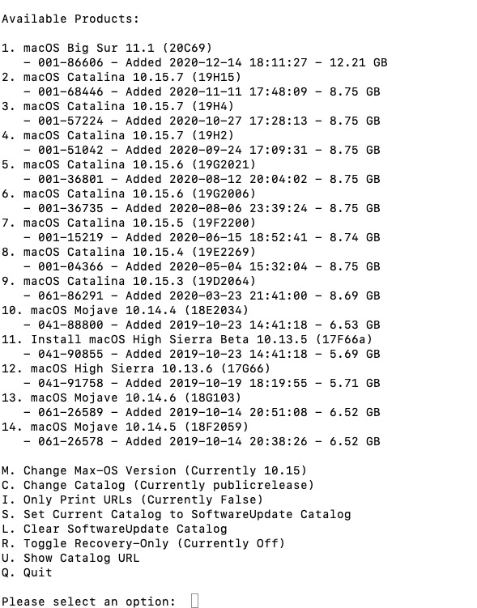
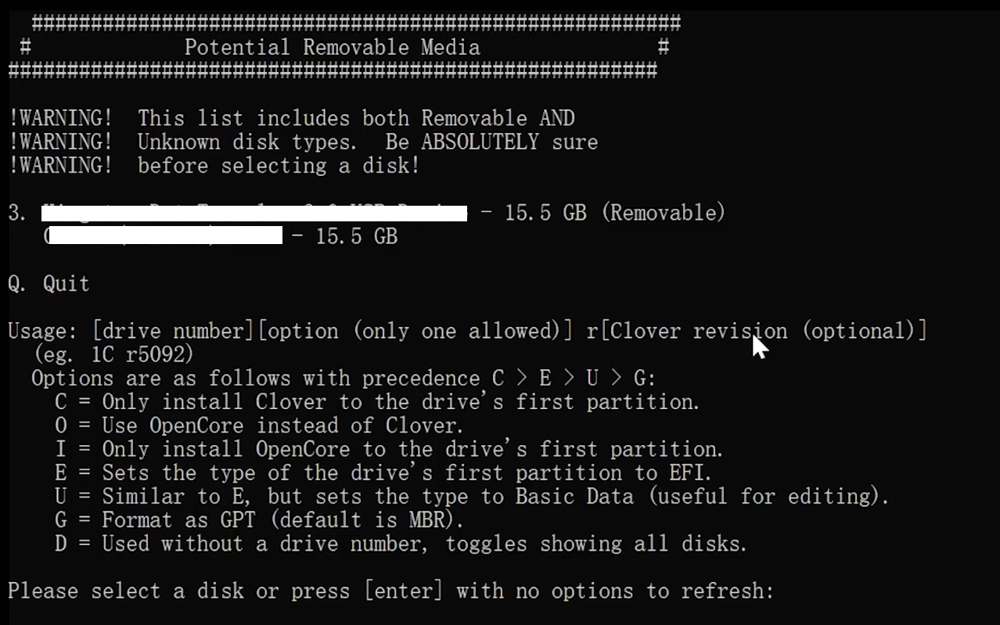
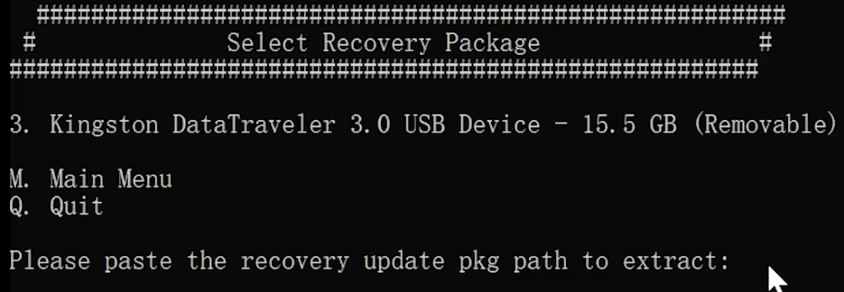
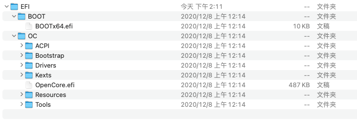
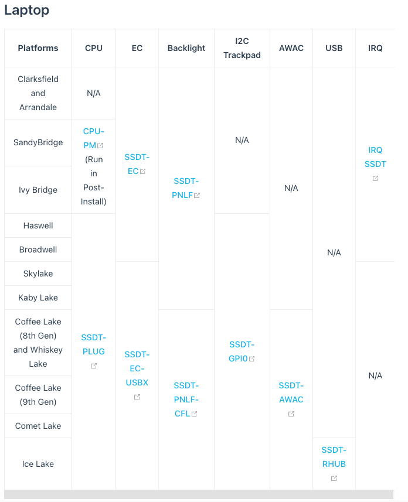
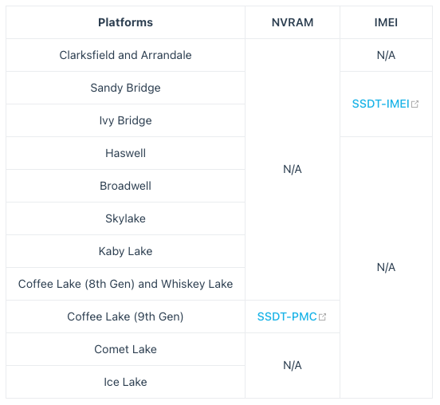

# This is a tutorial of hackintosh （Use Opencore)
##  Before writing : "It's not a perfect journey.  Use and cherish." ##

### Prerequisites

1. ***[The most important]*** Time and patience.
2. Know your hardware 
    + CPU generation
    + GPU
    + Matherland chipset generation(Always bind with CPU)
    + Storage chipset
    + Ethernet chipset
    + Wlan/Bluetooth chipset
    + Audio chipset
3. A usb flash disk. ***Recommanded the Sandisk Extreme PRO.*** 
4. A mac os .dmg : there are many sources you can find in the  internet. [Recommanded script](https://github.com/corpnewt/gibMacOS)
5. Python environment.

## Let's start
* **Usb creation**

    1. Download the Macos use [glibMacOS](https://github.com/corpnewt/gibMacOS). If you use Windows(with python3.x environment), just double click the "glibMacOS.bat", Mac os user click "glibMacOS.command", as this picture,
  </img>
 choose the os you want to download and wait for some times, then the os image will be saved in folder "macOS Downloads". *(If the image is too large for you, you can choose type one "R" and downloads the recovery image.)*
    2. Burn the os image into a usb flash disk. Just in "glibMacOS" folder, there is a script named "MakeInstall.bat" , it will help you to divide your usb flash disk into two partitions, and burn the opencore(or clover, depends on what you choose) into the first partition and the os image into the second partition. As pictures shows, type "3o" and then paste the OS image path just copied. </img>
    ================================================================
     </img>
    3. Costom your own OpenCore. First delete all the things in first usb partition, and download the lastest [OpenCore package](https://github.com/acidanthera/OpenCorePkg/releases) and copy all files in "x64"(or "I32") folder into the usb flash disk's first partition. And then go into "OC" folder to costom your own OpenCore EFI.
* **Costom the Opencore**

    1. The files tree. This picture show all the file needed to copy into the usb's first partition. (Especially attention EFI folder itself is also needed.)
        + SSDTs and custom DSDTs(.aml) go in ACPI folder
        + Kexts(.kext) go in Kexts folder
        + Firmware drivers(.efi) go in the Drivers folder

    2. Gathering Files. 
        * **Firmware Drivers** (Must be placed in /EFI/OC/Drivers)
            * For the majority of systems, only 2 .efi drivers are needed.  
            [**HfsPlus.efi**](https://github.com/acidanthera/OcBinaryData/blob/master/Drivers/HfsPlus.efi) : To see the HFS volumes.  
            [**OpenRuntime.efi**](https://github.com/acidanthera/OpenCorePkg/releases) : Used as an extension for OpenCore to help with patching boot.efi for NVRAM fixes and better memory management.
            * The OpenCore package contains many drivers you can choose to delete or not.
        * **Kexts** (Must be placed in /EFI/OC/Kexts) A kext is a kernel extension, you can think of this as a driver for macOS.
            * Must needed  
            [**VirtualSMC**](https://github.com/acidanthera/VirtualSMC/releases) : Help us to boot macos.  
            [**Lilu**](https://github.com/acidanthera/Lilu/releases) : It's the patch for many Kexts. 

                **Above is just needed for boot, if you want more function just as audio driver or bettery manager, you need to add more Kexts.**

                Below is VirtualSMC plugins. (For hardware monitoring)
                * SMCProcessor.kext
                * SMCSuperIO.kext
                * SMCBatteryManager.kext
            * For graphics  
            [**WhateverGreen**](https://github.com/acidanthera/WhateverGreen/releases)
            * For audio  
            [**AppleALC**](https://github.com/acidanthera/AppleALC/releases)
            * For Ethernet  (One example : Intel's ethernet chipset)  
            [**IntelMausi**](https://github.com/acidanthera/IntelMausi/releases)
            * USB  
            [**USBInjectAll**](https://bitbucket.org/RehabMan/os-x-usb-inject-all/downloads/)  
            [**XHCI-unsupported**](https://github.com/RehabMan/OS-X-USB-Inject-All) This chipsets may needed.  
                * H370
                * B360
                * H310
                * Z390(Not needed on Mojave and newer)
                * X79
                * X99
                * AsRock boards(On Intel motherboards specifically, B460/Z490+ boards do not need it however)
            * WiFi and Bluetooth  
            Recommanded Brcm wireless card, many model don't need Kexts. Below is prepared for Intel.  
            [**AirportItlwm**](https://github.com/OpenIntelWireless/itlwm/releases)  
            [**IntelBluetoothFirmware**](https://github.com/OpenIntelWireless/IntelBluetoothFirmware/releases)  
                
                For some Brcm Card:  
            [**AirportBrcmFixup**](https://github.com/acidanthera/AirportBrcmFixup/releases)  
            [**BrcmPatchRAM**](https://github.com/acidanthera/BrcmPatchRAM/releases)
            * Something else  
            [**NVMeFix**](https://github.com/acidanthera/NVMeFix/releases) : Just as the name.
            [**CpuTscSync**](https://github.com/acidanthera/CpuTscSync/releases) : For some Intel HEDT to syncing TSC  
            
        * **SSDTs** (Must be placed in /EFI/OC/ACPI)  
            * There is a picture tell you what you needs.  
            * And a [script](https://github.com/corpnewt/SSDTTime) to build SSDTs.
          
            
    3. Modify the config.plist  
        ***This term cost lots of time and you need to keep patient.***
        1. First you need to copy the sample.plist from Docs (One folder of your downloaded OpenCore package.) folder into your USB's first partition's EFI folder and rename as config.plist.  
        2. Then you need a plist editor, [**ProperTree**](https://github.com/corpnewt/ProperTree) is recommanded.
        3. Open the config.plist with ProperTree.  **Add what have gathered files into config.plist**. In Windows, use Ctrl+Shift+R to choose "OC" folder, MacOS use Command+Shift+R.
        4. [This link](https://dortania.github.io/OpenCore-Install-Guide/config.plist/comet-lake.html#starting-point) will teach you how to modify your config.plist to adapt your hardware.
        5. After modify the config.plist, [this link](https://opencore.slowgeek.com/) can help to check whether your config is correct and give some advices.
        
* **Installation**  
    1. First, you need to disable some options in your bios. Below is what you must close.  
        * Fast Boot
        * Secure Boot
        * Serial/COM Port
        * Parallel Port
        * VT-d (can be enabled if you set DisableIoMapper to YES)(mmio)
        * CSM
        * Thunderbolt(For initial install, as Thunderbolt can cause issues if not setup correctly)
        * Intel SGX
        * Intel Platform Trust
        * CFG Lock (MSR 0xE2 write protection)(This must be off, if you can't find the option then enable AppleXcpmCfgLock under Kernel -> Quirks. Your hack will not boot with CFG-Lock enabled)
    2. Then you should enable some options.
        * VT-x 
        * Above 4G decoding
        * Hyper-Threading
        * Execute Disable Bit
        * EHCI/XHCI Hand-off
        * OS type: Windows 8.1/10 UEFI Mode 
        * DVMT Pre-Allocated(iGPU Memory): 64MB
        * SATA Mode: AHCI

    3. Start installation  
    * If you can get here correctly, the graphical installation cannot beat you.  
    * What you need pay attention is that before start installation, you need to erase your Disk to APFS type.
* **After installation**  
    [Opencore Configurator](https://mackie100projects.altervista.org/opencore-configurator/) is needed for this part. Another tool named [hackintool](https://github.com/headkaze/Hackintool/releases/tag/3.4.9) is also recommanded.  
    1. Mount the EFI partition of you disk. If you have difficult in mount EFI partition with terminal, you can use Opencore Configurator. 
        * Open it and find tools in taskbar, click the mount EFI to mount your EFI partition of you disk. 
    2. After mount the EFI partition, you need to copy the EFI folder from usb flash disk to EFI partition of your disk in desktop/laptop.
    3. Find a serial number of your computer.   
        1. Open the config.plist what you have just copy into EFI partition with Opencore Configurator.
        2. Choose "PlatformInfo" -> "DataHub - Generic - PlatformNVRAM". Click generate System Serial Number/System UUID/ROM at where you find check mark with "write into config.plist", and go to [**this link**](https://checkcoverage.apple.com/us/en/) to check whether the number is vaild. If it is not vaild, congratulations to you!  Then you can just save the config.plist in Opencore Configurator. 
        3. If you can done all the above, your computer is a eligible BLACK_APPLE device. (Or name maybe Hackintosh) But there still long way to go, just as find more Kexts, change SSDT to get more functions. 
        4. Make it approach to the REAL APPLE DEVICE is a beautiful journey, Good luck to you.
### Appendix
This is a approximately perfect [EFI configuration](./EFI) of DELL OptiPlex 7080.

This tutorial is a simple modified version of offical [OpenCore Install Guide](https://dortania.github.io/OpenCore-Install-Guide/), it's easy to unstandard and if you have any questions or advices, please contact me.(glarebackbluewhale@gmail.com)
